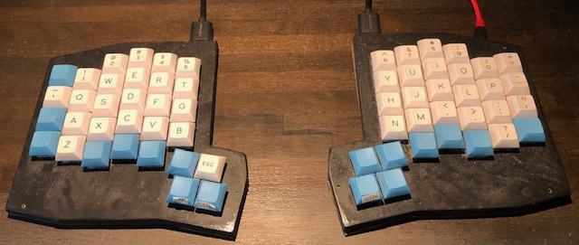
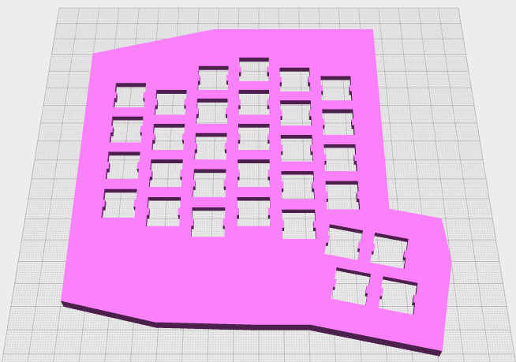

# The Ada Keyboard 
Columnar and column-staggered split mechanical keyboard with sane thumb clusters

Toolchain
---

A keyboard shell is being modeling using [OpenJSCAD](http://openjscad.org) ([User Guide](https://en.wikibooks.org/wiki/OpenJSCAD_User_Guide)). The currently released version of OpenJSCAD (0.5.2) does not properly load relative `include` paths; if you're developing locally and would like to load the model consider using [my fork](https://github.com/jcoleman/OpenJSCAD.org/) ([hosted viewer](https://jcoleman.github.io/OpenJSCAD.org/)) instead.

You can [view the current 3D model in the OpenJSCAD viewer](https://jcoleman.github.io/OpenJSCAD.org/#https://cdn.jsdelivr.net/gh/jcoleman/ada-keyboard/case/main.js). Without selecting any additional options, the viewer will render the switch plate as in the screenshot below.

History
---

My first introduction to columnar keyboards was Massdrop Ergodox kit that I assembled. I already loved split keyboards having used a Kinesis Freestyle for several years. While the columnar layout took a few days to become productive with, I can't imagine using a traditional row-staggered layout any longer. In addition the thumb clusters seemed like an obviously missing piece of modern keyboard design.

I gradually came to believe that the Ergodox--while an amazing step in the right direction--had several flaws for my usage. First, the column staggering wasn't nearly pronounced enough. Second, the thumb clusters were too far away from the primary matrix and only a few of the keys were usable for me.

Eventually I came to believe that there wasn't yet an open-source keyboard design that fit my needs exactly, so I begin this project to scratch that itch. I began by building a copy of Technomany's Atreus to learn how to hand-wire a board as well as switch to a different AVR board.

Subsequently I tweaked the Atreus 3D OpenSCAD design to include an additional column and row as well as a middle thumb switch.

Based on that experience I've started this from-scratch design.

Design Goals
---

- More column offsetting than the Ergodox (since it doesn't even come close to having enough to allow my fingers to naturally rest on the home row with the same curve/bend/flex).
- Enough rows/columns for relatively traditional layouts (i.e., _roughly_ 60% instead of 40% like the Atreus).
- Closer (and redesigned) thumb clusters (the Ergodox's are too far away from the primary matrix, and several keys are hard to hit).
- Removal of switches I don't use (like the bottom one on each of the two pinky columns on both sides) in favor of shifting the remaining keys in those columns to have the most frequently used being easiest to reach -- e.g., shift).
- Ability to make either a truly split (two piece) _or_ a combined single piece board for travel.

Future Improvements
---

- Optional more radical non-2D layouts (a la Kinesis Advantage, for example).
- Optional single-piece design (possibly with hinged tenting).
- Wiring instructions.
- PCB design.
- Bluetooth.

# Developing
---

- [Install Yarn](https://classic.yarnpkg.com/en/docs/install/) (note: Debian/Ubuntu default packages may not be new enough; use Yarn's repo instead).
- Run tests (uses the [Jest](https://jestjs.io/) framework) with `yarn test` or `yarn jest`. Optionally run a single file by also passing the test file path.

You can use an interactive debugger in tests by adding a `debugger;` line and either:
  - Run `node --inspect-brk node_modules/.bin/jest [test file path]`
  - Open Chrome/Chromium to [chrome://inspect](chrome://inspect) and clicking 'Open dedicated DevTools for Node'.
Or, for a command-line only debugger:
  - `inode inspect node_modules/.bin/jest [test file path]`
